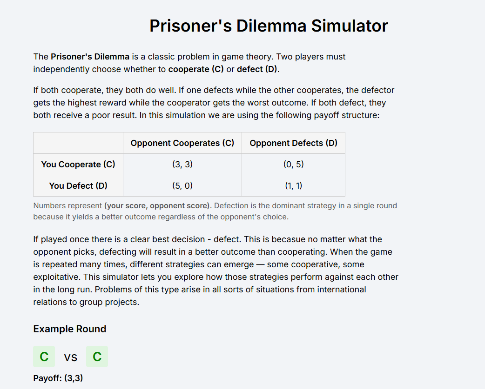
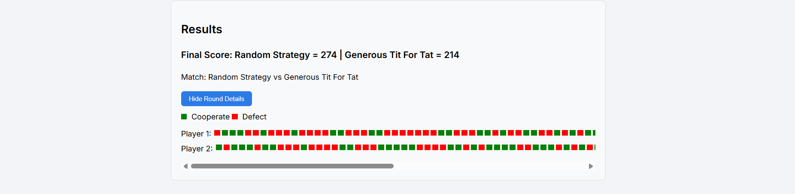
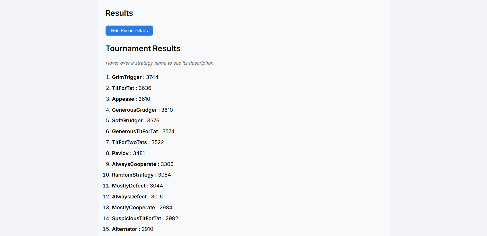

# Prisoner's Dilemma Simulator

## Live Demo
Check out the running web application [here](https://prisoners-dilemma-simulator.onrender.com)!

## Overview
This project is an interactive web application that allows users to explore the **Prisoner's Dilemma** problem from game theory. In the Prisoner's Dilemma, two players must independently choose whether to cooperate or defect. While defection is always the optimal choice in a single round, repeated interactions can lead to the emergence of cooperative strategies. Due to how this replicates many real life scenarios, this is often used as a fun introduction topic for game theory.

The goal of this project is to allow users to experiment with these ideas by simulating repeated Prisoner's Dilemma matches between different strategies. Users can run individual head-to-head simulations or full tournaments where every strategy competes against every other strategy. The results allow users to observe how different strategies behave over time and which strategies perform best in different environments.

The application is built using Django for the backend and JavaScript for the interactive frontend. The backend is responsible for managing the simulation logic and storing match results, while the frontend dynamically displays simulation results, timelines, and tournament leaderboards.

## Distinctiveness and Complexity

This project is distinct from the other projects in the course because it focuses on game theory simulations rather than more common project types such as commerce sites or social networks. The application implements a simulation engine that models repeated interactions between autonomous strategies. Each strategy is implemented as a Python class with its own behavioral rules that determine whether it cooperates or defects in each round. Here are 5 complex parts of the project: 

**Strategies**
Strategies are modular Python classes that are registered in a strategy registry and can be dynamically selected by the user. Each strategy maintains access to the full history of previous moves and makes decisions based on that history. This allows for the implementation of sophisticated behaviors such as retaliation, forgiveness, pattern recognition, and probabilistic decision making.

**Simulation Engine**
The project also includes a simulation engine that runs repeated rounds of the game, tracks the history of moves, and calculates cumulative payoffs. This engine supports the addition of noise, which randomly flips moves with a given probability. This feature allows the simulation to model mistakes or randomness that occur in real-world interactions that can affect the performance of different strategies.

**Tournament System**
Instead of running a single match between two strategies, the application can run a round-robin tournament in which every strategy competes against every other strategy. The scores from these matches are added together to produce a leaderboard showing which strategies perform best overall.

**Interactive Frontend**
JavaScript is used to fetch simulation results and dynamically render the results without reloading the page. The application includes visualizations such as a timeline of colored squares that represent cooperation and defection in each round, allowing users to quickly identify patterns of behavior between strategies.
Additionally, strategy descriptions are integrated into the interface using hover tooltips, allowing users to quickly understand how each strategy behaves while viewing tournament results. 

Overall, the project combines backend simulation logic, frontend visualisation, and interactive controls to create an educational tool for exploring repeated games and strategic behavior.

## Files

**engine.py**

Contains the core simulation engine. This file defines the payoff matrix and the functions responsible for running simulations between strategies in head to head or round robin tournament format. It also includes the noise function that can randomly flip moves to simulate mistakes.

**strategies.py**

Defines all strategy classes used in the simulations. Each strategy implements a `move` method that determines whether the strategy cooperates or defects based on the history of moves.

**views.py**

This file contains the Django views that connect the frontend interface to the backend simulation logic. The index view renders the main page of the application. The simulate_view runs head-to-head simulations between two selected strategies and returns the round-by-round results as JSON while also saving the final result to the database. The tournament_view runs a round-robin tournament between all strategies and returns a leaderboard of total scores. The strategies_view provides the frontend with information about available strategies so they can be displayed in dropdown menus and tooltips.

**models.py**

Defines the `MatchResult` model used to store the results of head-to-head simulations. This includes the strategies used, final scores, number of rounds, noise level, and timestamp.

**simulate.js**

This file contains the main frontend logic for the application. It handles user interactions such as running head-to-head simulations and tournaments, and dynamically updating the page with the returned results. The script renders visualisations of matches using timelines of colored squares to represent cooperation and defection, maintains a history of previous matches, and updates the tournament leaderboard. It also loads strategy information from the backend so that strategy names, descriptions, and hover tooltips can be displayed in the interface.

**index.html**
This is the main user interface for the application. It contains the layout of the page, including the explanation of the Prisoner’s Dilemma, the simulation controls, the tournament controls, and the results sections. The page structure is organised using section cards to separate different parts of the interface. Most of the interactive functionality is handled by JavaScript.

**styles.css**

Defines the styling of the application, including layout, cards, buttons, and the visualization elements used for simulation timelines.

**admin.py**

Registers the MatchResult model with Django’s admin interface so that stored simulation results can be viewed through the Django admin dashboard.

**requirements.txt**

Lists the Python dependencies required to run the project. 

## How to Run the Application

1. Ensure that **Python** is installed on your system.
2. Install the required dependencies: pip install -r requirements.txt
3. Apply database migrations: python manage.py migrate
4. Create an admin user if you want to access the Django admin interface: python manage.py createsuperuser
5. Start the development server: python manage.py runserer
6. Navigate to http://127.0.0.1:8000/ in a web browser.

## Additional Information

This project was inspired by Professor Robert Axelrod’s Prisoner’s Dilemma tournaments. In these experiments, Axelrod invited researchers to submit computer programs representing strategies for the repeated Prisoner’s Dilemma. Each strategy was then played against every other strategy in a round-robin tournament to determine which performed best overall.

One of the most surprising outcomes of these tournaments was that the simple strategy Tit for Tat  performed extremely well. Tit for Tat begins by cooperating and then copies the opponent’s previous move. Despite its simplicity, the strategy proved highly effective because it is nice (it never defects first), retaliatory (it punishes defection), and forgiving (it returns to cooperation if the opponent does).

The results of these tournaments helped demonstrate how cooperation can emerge even in competitive environments where individuals act in their own self-interest. Later studies expanded on Axelrod’s work by exploring the effects of noise, larger populations of strategies, and evolutionary dynamics.

## Screenshots

### Introduction

### Head to head simulation

### Tournament Leaderboard

